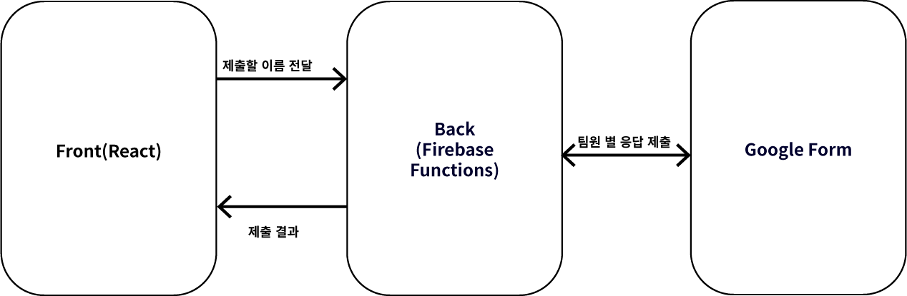

# Daily Health

매일 제출해야하는 구글 폼 작성을 간편하게 하기 위한 앱

배포되어 있지만, 아무나 사용하는 것을 막기위해 url은 공개하지 않습니다.

## 목적

매일 아침 코로나 관련 구글 설문을 작성하여 제출해야 하는데, 매일 같은 내용을 작성하는 것이 귀찮아서 쉽게 해보려고 만든 앱입니다.

현재(21.02) dev브랜치에서 개발용 서버 분리와 추가 기능인 모바일 푸쉬 알림기능을 구현 중입니다.

## 동작 예시

팀원의 이름이 목록에 있고, 본인의 이름을 눌러서 제출 버튼을 눌러 제출합니다.

## 구조

### 프론트엔드

간단히 이름을 선택하고 서버에 전달하며, 제출 결과를 보여주는 역할만 합니다. 다만 편리한 사용을 위해 PWA로 모바일에서 설치하여 사용할 수 있도록 하였습니다.

### 백엔드

선택된 팀원에 따라 미리 작성해놓은 정보를 구글 설문지에 제출하는 요청을 보냅니다.

## 프로젝트를 진행하며 고려했던 점

블로그에 제가 작성한 글에서 확인하실 수 있습니다.

https://velog.io/@sds564/%EC%BD%94%EB%A1%9C%EB%82%98-%EA%B1%B4%EA%B0%95-%EC%84%A4%EB%AC%B8-%EC%95%B1%EC%9D%84-%EB%A7%8C%EB%93%A4%EB%A9%B4%EC%84%9Cfeat.-google-forms-react-pwa-firebase-functions

